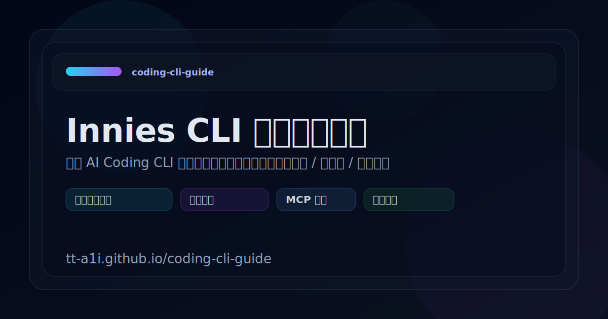

<div align="center">



<br/><br/>

# Coding CLI Guide

**AI Coding CLI 架构交互式学习指南**<br/>
深入拆解 Gemini CLI 内部实现，从启动链路到工具调度，从 Agent Loop 到安全沙箱

<br/>

[](https://tt-a1i.github.io/coding-cli-guide/)

<br/>


</div>

<br/>

---

## Why

AI Coding CLI（如 Gemini CLI、Claude Code、Qwen Code）的源码动辄数万行，直接阅读容易迷失。本项目将 **Gemini CLI** 的核心架构提炼为 **158 个交互式页面**，配合 **Mermaid 流程图** 和 **120+ 步进动画**，让你在浏览器中就能直观理解每一个内部机制。

> 可分享 · 可检索 · 可深链 — 每个知识点都有独立 URL，方便团队内传阅与讨论。

---

## Features

<table>
<tr>
<td width="50%">

### 📖 全景式架构拆解
从 CLI 启动的第一行代码，到用户输入→模型调用→工具执行→响应渲染的完整请求生命周期，每一步都有对应的可视化页面。

</td>
<td width="50%">

### 🎬 120+ 步进动画
不是静态文档——关键流程（Agent Loop、工具调度、MCP 握手、Token 计算等）都配有可交互的逐步动画演示。

</td>
</tr>
<tr>
<td>

### 🔧 深入工具系统
工具注册、Schema 定义、并行调度、权限审批、结果缓存……完整覆盖从 `ToolReference` 到 `ToolScheduler` 的每个环节。

</td>
<td>

### 🛡️ 安全机制全解
审批模式、信任文件夹、沙箱隔离（Docker / Seatbelt）、Git Checkpointing、循环检测、命令注入检测——安全边界一览无余。

</td>
</tr>
<tr>
<td>

### 🔌 扩展与集成
Agent 框架、Subagent 系统、MCP 协议集成、IDE 扩展（VS Code / Cursor / Zed）、Prompt 注册表……了解 CLI 如何与外部世界交互。

</td>
<td>

### 🧭 多种学习路径
提供「快速入门」「端到端走读」「学习路径指南」等入口，无论你是想快速了解还是深入研究，都能找到合适的阅读路线。

</td>
</tr>
</table>

---

## Content Map

```
📂 快速入门          Start Here · 学习路径 · 架构概览 · 端到端走读 · 术语表
⚙️ 核心机制          启动链路 · 请求生命周期 · 交互主循环 · Turn 状态机 · Token 体系
                     会话持久化 · 服务层架构 · Prompt 构建 · 流式响应 · 多厂商兼容层
🔧 工具系统          工具参考 · 开发指南 · 调度详解 · 文件发现 · 工具架构 · 执行流程
💻 命令系统          斜杠命令 · 自定义命令 · @命令 · Shell 模式 · Prompt 处理器 · 记忆系统
🔌 扩展集成          Agent 框架 · Agent Skills · Subagent · MCP 集成 · IDE 集成 · Zed ACP
🎯 事件与策略        Hook 系统 · Policy 引擎 · 消息总线 · 模型路由 · 模型可用性
🛡️ 安全可靠          审批模式 · 信任机制 · 检查点恢复 · 沙箱系统 · 循环检测 · 错误恢复
▶️ 运行模式          非交互模式 · 聊天压缩 · 输出格式化 · 会话恢复 · 会话录制
🎨 UI 与观测         渲染层 · 状态管理 · 组件库 · React Hooks · 键盘绑定 · 主题 · 遥测
🎬 动画演示          50+ 核心流程动画 + 60+ 内部机制动画
📚 附录              配置系统 · 认证流程 · 模型配置 · 设计权衡 · 并发模式 · 错误恢复模式
```

---

## Quick Start

### 环境要求

- **Node.js** >= 18
- **npm** >= 9

### 本地运行

```bash
# 克隆
git clone https://github.com/tt-a1i/coding-cli-guide.git
cd coding-cli-guide

# 安装依赖
npm install

# 启动开发服务器
npm run dev
```

浏览器访问 **http://localhost:5173**

### 或者直接在线体验

👉 **https://tt-a1i.github.io/coding-cli-guide/**

---

## Tech Stack

| 分类 | 技术 |
|------|------|
| **框架** | React 19 (Hooks) |
| **语言** | TypeScript 5.9 |
| **构建** | Vite 7 |
| **样式** | Tailwind CSS 4 |
| **流程图** | Mermaid |
| **代码高亮** | Prism.js |
| **部署** | GitHub Pages (GitHub Actions) |

---

## Development

```bash
npm run dev       # 启动开发服务器
npm run build     # 构建生产版本（含 TypeScript 类型检查）
npm run preview   # 预览生产构建
npm run lint      # 代码检查
```

---

## Project Structure

```
src/
├── pages/              # 158 个内容页面（含 120+ 动画页）
│   └── animations/     # 动画辅助组件
├── components/         # 通用 UI 组件
│   ├── MermaidDiagram  #   Mermaid 流程图渲染
│   ├── CodeBlock       #   代码块 + 语法高亮
│   ├── FlowDiagram     #   流程图组件
│   ├── Tabs            #   标签页切换
│   └── ...
├── contexts/           # React Context
├── nav.ts              # 导航树定义（13 个分组 · 160 个条目）
├── types/              # TypeScript 类型
└── utils/              # 工具函数
```

---

## Related Projects

| 项目 | 说明 |
|------|------|
| [Gemini CLI](https://github.com/google-gemini/gemini-cli) | Google 官方 Gemini CLI — 本指南的分析对象 |
| [Qwen Code](https://github.com/QwenLM/qwen-code) | 基于 Gemini CLI 的衍生实现，可对照阅读 |

---

## Contributing

欢迎提交 Issue 和 Pull Request！无论是纠正错误、补充内容，还是改进动画，都非常感谢。

---

## License

[MIT](./LICENSE.md)

<div align="center">
<br/>
<sub>Built with React + TypeScript + Tailwind CSS + Mermaid</sub>
</div>
